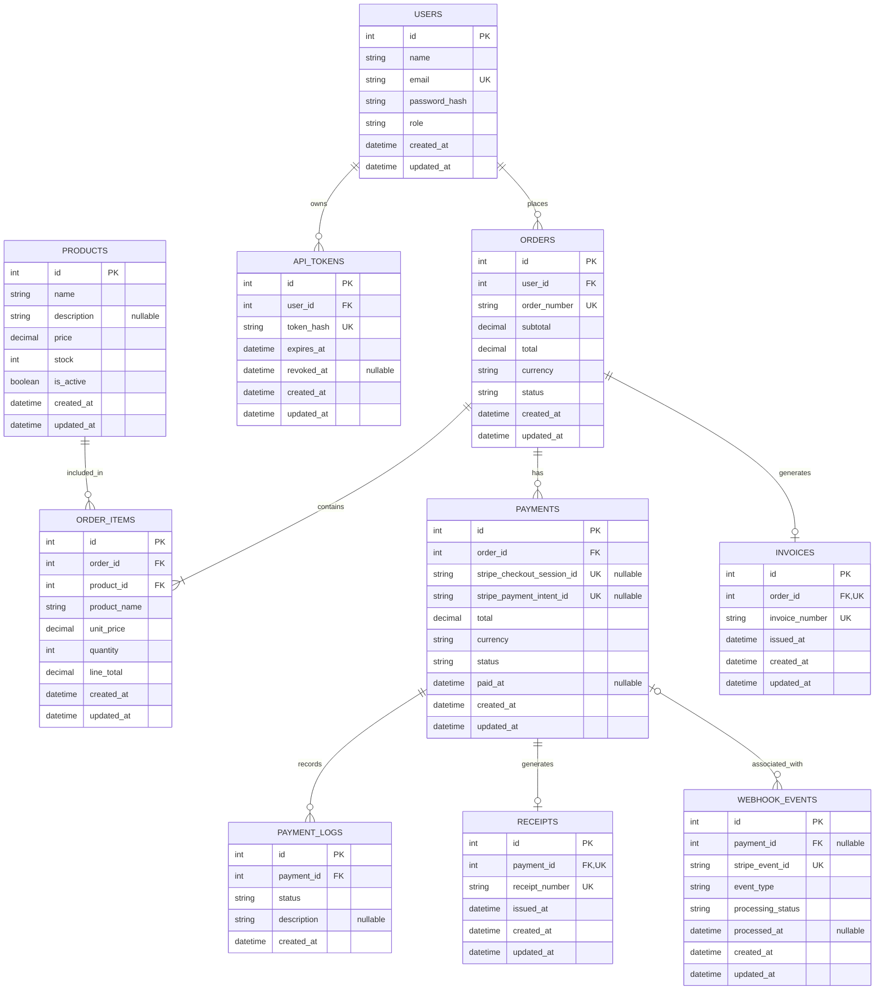

# PayDesk – Entity Relationship Diagram (ERD)

```mermaid
erDiagram
    USERS ||--o{ ORDERS : places
    USERS ||--o{ API_TOKENS : owns

    ORDERS ||--|{ ORDER_ITEMS : contains
    PRODUCTS ||--o{ ORDER_ITEMS : included_in

    ORDERS ||--o{ PAYMENTS : has
    PAYMENTS ||--o{ PAYMENT_LOGS : records

    ORDERS ||--o| INVOICES : generates
    PAYMENTS ||--o| RECEIPTS : generates

    PAYMENTS o|--o{ WEBHOOK_EVENTS : associated_with

    USERS {
        int id PK
        string name
        string email UK
        string password_hash
        string role
        datetime created_at
        datetime updated_at
    }

    PRODUCTS {
        int id PK
        string name
        string description "nullable"
        decimal price
        int stock
        boolean is_active
        datetime created_at
        datetime updated_at
    }

    ORDERS {
        int id PK
        int user_id FK
        string order_number UK
        decimal subtotal
        decimal total
        string currency
        string status
        datetime created_at
        datetime updated_at
    }

    ORDER_ITEMS {
        int id PK
        int order_id FK
        int product_id FK
        string product_name
        decimal unit_price
        int quantity
        decimal line_total
        datetime created_at
        datetime updated_at
    }

    PAYMENTS {
        int id PK
        int order_id FK
        string stripe_checkout_session_id UK "nullable"
        string stripe_payment_intent_id UK "nullable"
        decimal total
        string currency
        string status
        datetime paid_at "nullable"
        datetime created_at
        datetime updated_at
    }

    PAYMENT_LOGS {
        int id PK
        int payment_id FK
        string status
        string description "nullable"
        datetime created_at
    }

    INVOICES {
        int id PK
        int order_id FK,UK
        string invoice_number UK
        datetime issued_at
        datetime created_at
        datetime updated_at
    }

    RECEIPTS {
        int id PK
        int payment_id FK,UK
        string receipt_number UK
        datetime issued_at
        datetime created_at
        datetime updated_at
    }

    WEBHOOK_EVENTS {
        int id PK
        int payment_id FK "nullable"
        string stripe_event_id UK
        string event_type
        string processing_status
        datetime processed_at "nullable"
        datetime created_at
        datetime updated_at
    }

    API_TOKENS {
        int id PK
        int user_id FK
        string token_hash UK
        datetime expires_at
        datetime revoked_at "nullable"
        datetime created_at
        datetime updated_at
    }
```
